# Poly-React: Render React Application within TRIRIGA Perceptive Application
The IBM TRIRIGA Application Platform introduces an MVC-based UX framework for Polymer-based applications. The model-view-controller (MVC) approach separates the application into three components or layers: the model, view, and controller. 

The framework enables third-party application developers to build intuitive user interface more easily to meet business requirements and with improved performance. But the view layer is built upon the library of Polymer web components. Which means any application developer need to use Polymer web components for developing the views.

The problem arises when organization wants to use a different library to build the user interface within the perceptive application. And as there is no direct support from the framework to render components from different library and technology.

The aim of this code pattern is to demonstrate how to blend technologies (Polymer and React) together to obtain desired User Experience, using ‘PolyReact Wrapper’. At its core we will be rendering React Application within the Polymer web-components in TRIRIGA Perceptive Application framework.

In this code pattern, we will create a starter dashboard using TRIRIGA UX framework and IBM Carbon Design System / IBM Watson IoT Design Patterns and Assets Library which is based on React components. By the end of this code pattern, users will understand how to,
* Create a TRIRIGA Perceptive Application
* Develop a React application
* Build a starter dashboard using  IBM Carbon Design System / IBM Watson IoT Design Patterns and Assets Library React components
* Render the React application in TRIRIGA Perceptive Application
* At the end you should be able to see following dashboard

    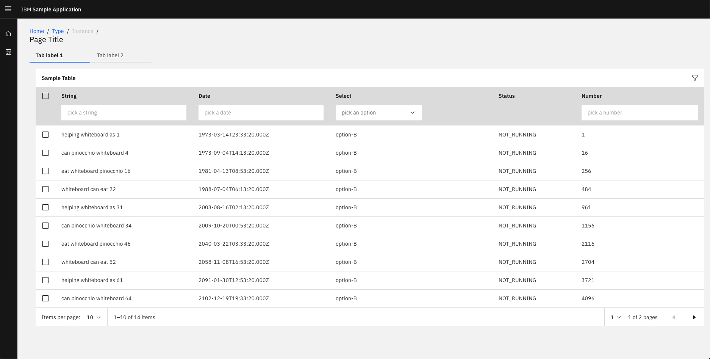

## Prerequisites 
- Basics of TRIRIGA Perceptive Applications and UX Framework
- Basics of ReactJS
- NodeJS

## Flow
1. [Creating TRIRIGA Perceptive Application](#creating-tririga-perceptive-application)
2. [Setting up the development environment](#setting-up-the-development-environment)
3. [Creating the application javascript](#creating-the-application-javascript)
4. [Creating a standalone React Application](#creating-a-standalone-react-application)
5. [Rendering React Application in TRIRIGA Perceptive Application](#rendering-react-application-in-tririga-perceptive-application)
6. [Rendering Carbon Design System components / PAL in TRIRIGA Perceptive Application](#rendering-carbon-design-system-components--pal-in-tririga-perceptive-application)

## Creating TRIRIGA Perceptive Application
To create perceptive application we need to create following modules.

More details can be found [here](https://www.ibm.com/support/pages/getting-started-tririga-perceptive-applications)

#### Create Model Designer
Steps to create Model Designer

1. Go to **Tools -> UX Designers -> Model Designer** 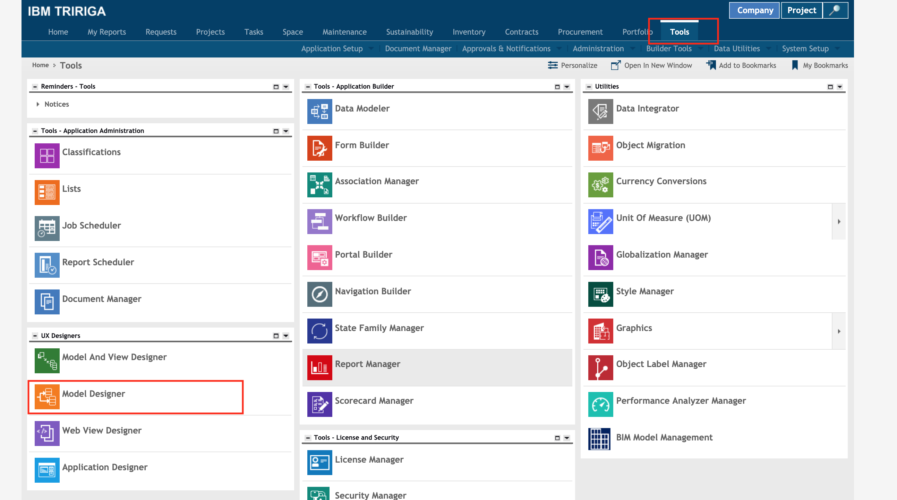
2. In Model Designer click on **Add** button 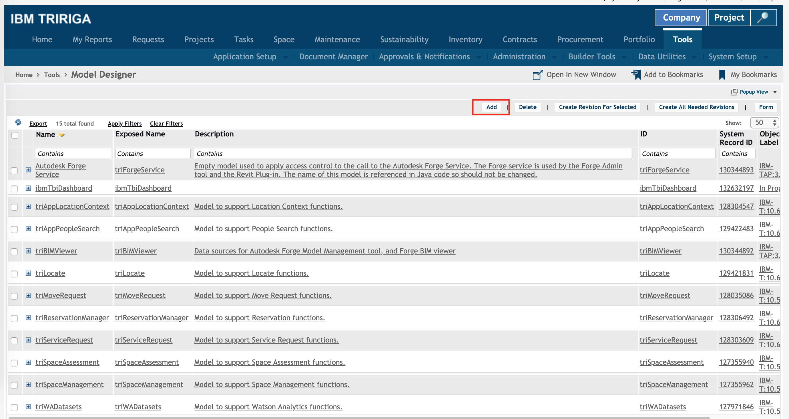
3. Fill the Name,ID,Exposed Name and Description, for example "ibmSampleApp" and click on **Create** button 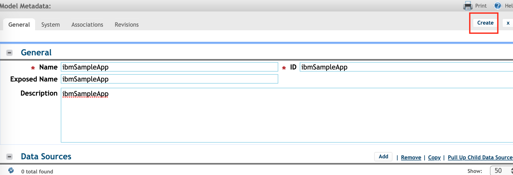
4. Then click on **Save & Close** button 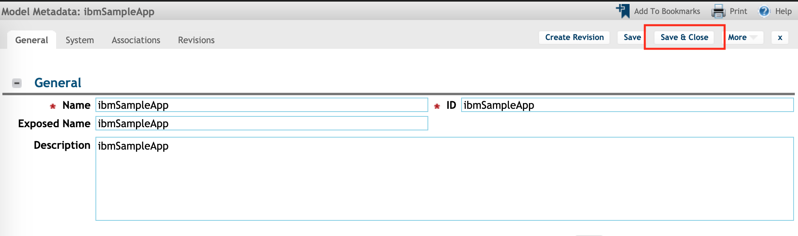

Now we have successfully created Model Designer.

#### Create Web View Designer
Steps to create Web View Designer

1. Go to **Tools -> UX Designers -> Web View Designer** 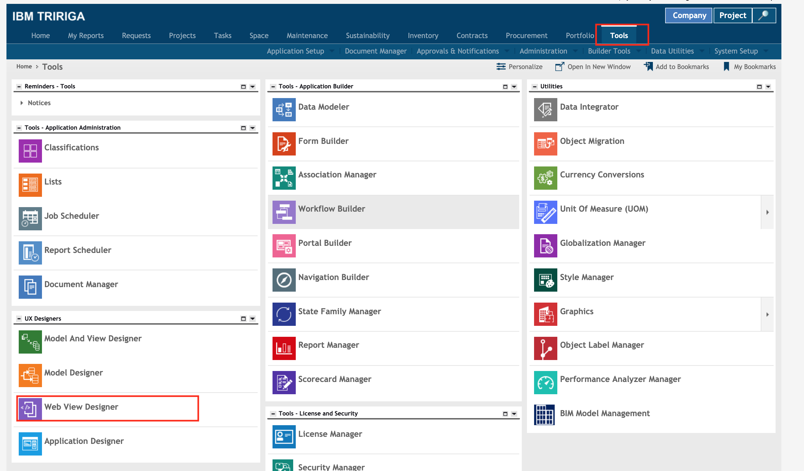
2. In Web View Designer click on **Add** button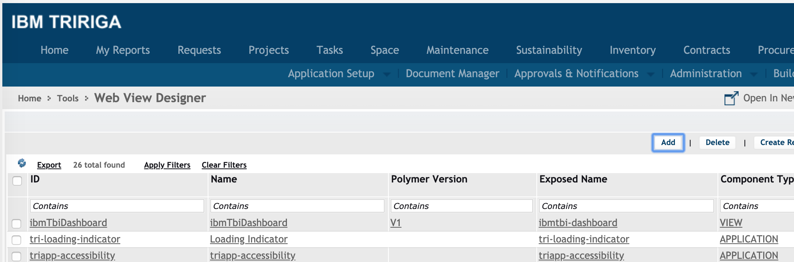
3. Fill the Name,ID,Exposed Name and Description as "ibmSampleApp" make sure exposed name is all lowercase and separated by "-" e.g. "ibm-sampleapp". 

    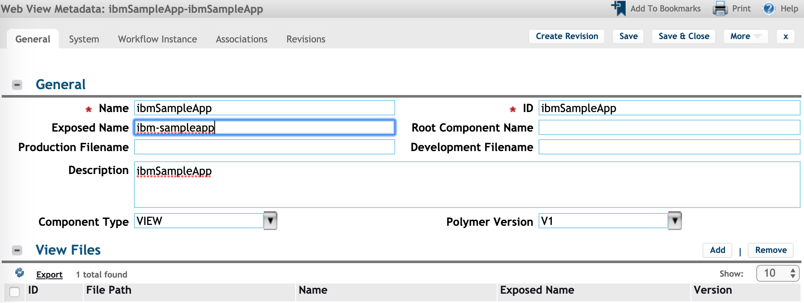

    Select Polymer Version as V1 and click on **Create** button.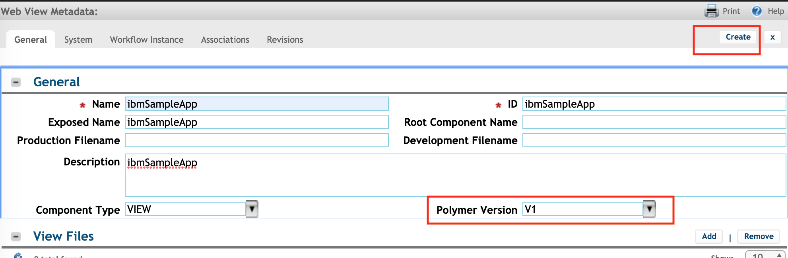

4. Click on **Save & Close** button. 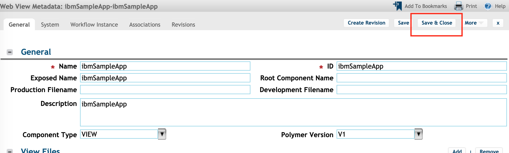

Now we have successfully created Web View Designer.

#### Create Model and View Designer
Steps to create Model and View Designer

1. Go to **Tools -> UX Designers -> Model And View Designer** 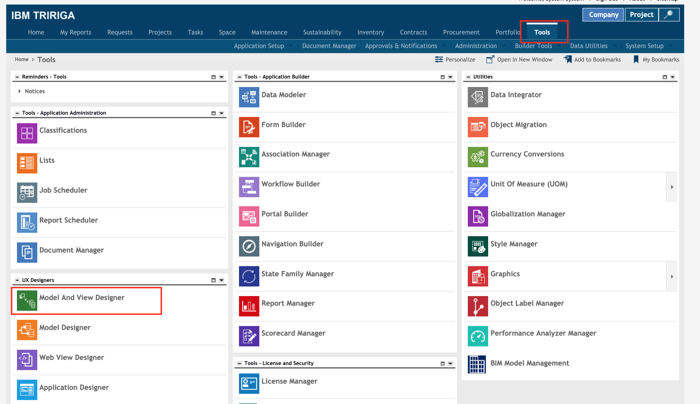
2. In Model and View Designer click on **Add** button. 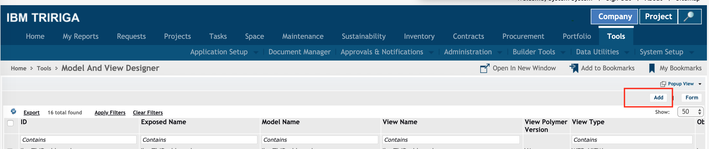
3. Fill the Name, ID, Exposed Name and Description as "ibmSampleApp".

    Select Model Name and View Name as "ibmSampleApp", then click on **Create** button. 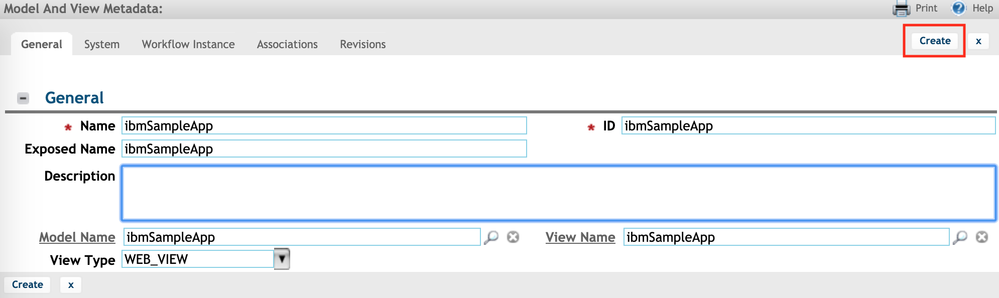
4. Click on **Save & Close** button.    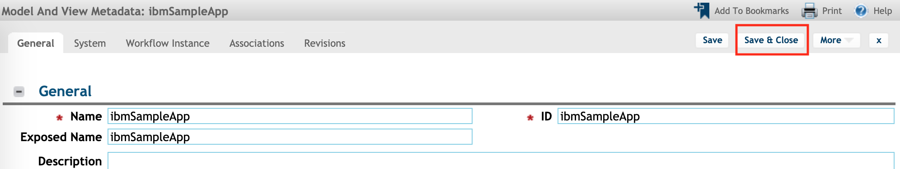

Now we have successfully created Model and View Designer.

#### Create Application Designer
Steps to create Application Designer

1. Go to **Tools -> UX Designers -> Application Designer** 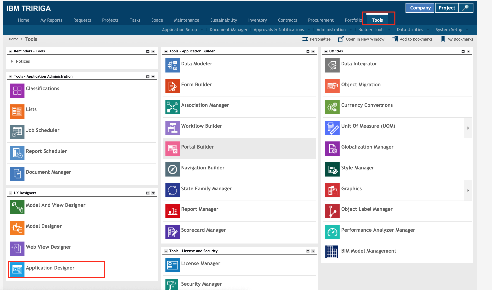
2. In Application Designer click on **Add** button. 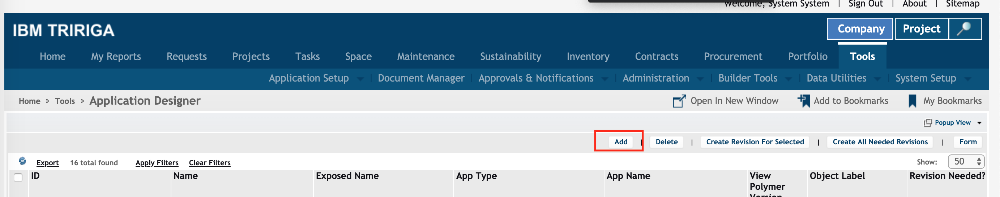
3. Fill the Name, ID as "ibmSampleApp", Instance ID as -1 and Exposed Name as "SampleApp". 

    Select App Name as "ibmSampleApp", then click on **Create** button. 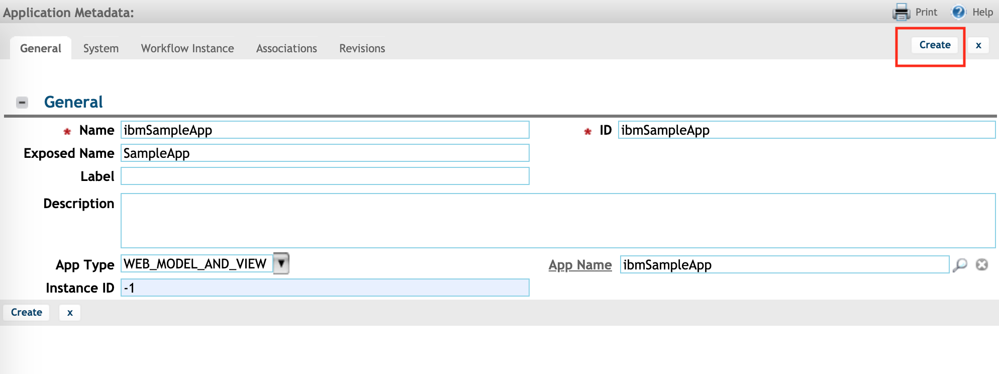
4. Click on **Save & Close** button. 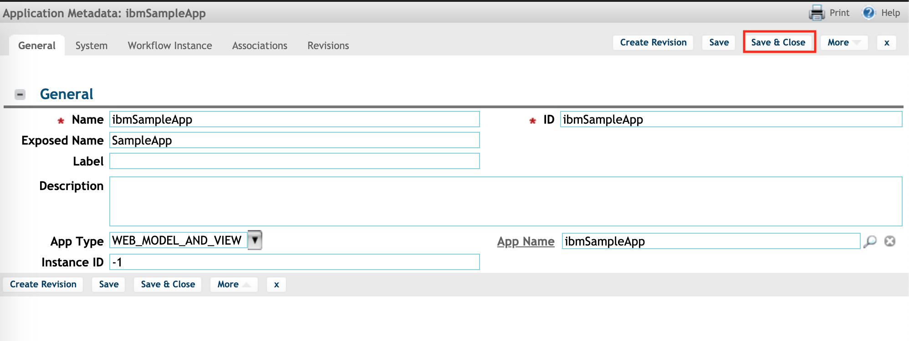

Now we have successfully created Application Designer.

You access sample application here - `http(s)://<TRIRIGA_HOST>:<PORT>/<CONTEXT_ROOT>/p/web/SampleApp`. You should see a loading page.


## Setting up the development environment 


### Setup 
1. Create a new directory `mkdir SampleApp` and `cd SampleApp`
2. Install tri-deploy and tri-template using node npm.
    `npm install @tririga/tri-deploy -g` and `npm install tri-template -g`
3. Create a new directory `mkdir ibm-sampleapp` and add a view to tri-deploy using tri-template
    `tri-template -t starter -e ibm-sampleapp -d ibm-sampleapp/`, this will create a starting page template in ibm-sampleapp/ibm-sampleapp.html
4. Push the template file using `tri-deploy -t <tririga_url> -u <user> -p <password> -v ibm-sampleapp -d ibm-sampleapp -y 1`
5. Now you will be able to see Starter View for ibm-sampleapp here - `http(s)://<TRIRIGA_HOST>:<PORT>/<CONTEXT_ROOT>/p/web/SampleApp` 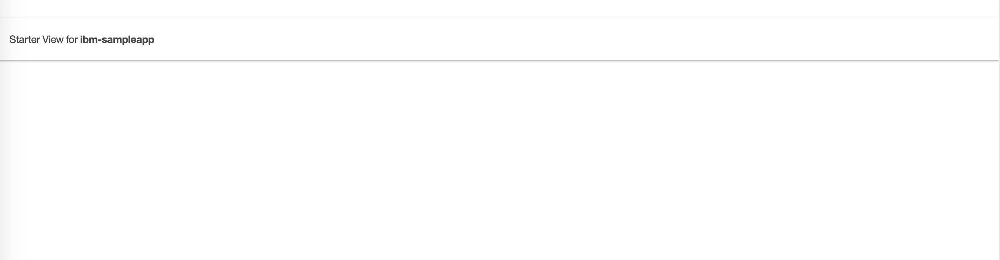

At this stage your SampleApp directory should look like [this](./src/0_setup_dev_env/SampleApp)

### Modifying the template for "Hello World"

1. Open `ibm-sampleapp/ibm-sampleapp.html` in editor of your choice and update the template to classic "Hello World"

    ```
    <link rel="import" href="../triplat-view-behavior/triplat-view-behavior.html">

    <link rel="import" href="../paper-material/paper-material.html">

    <dom-module id="ibm-sampleapp">
        <template>
            <H1>Hello World</H1>
        </template>
    </dom-module>
    <script>
        Polymer({

            is: "ibm-sampleapp",

            behaviors: [TriPlatViewBehavior]

        });
    </script>
    ```


2. Save the file and push it by using `tri-deploy -t <tririga_url> -u <user> -p <password> -v ibm-sampleapp -d ibm-sampleapp -y 1` and you will be able to see classic "Hello World" here - `http(s)://<TRIRIGA_HOST>:<PORT>/<CONTEXT_ROOT>/p/web/SampleApp`

    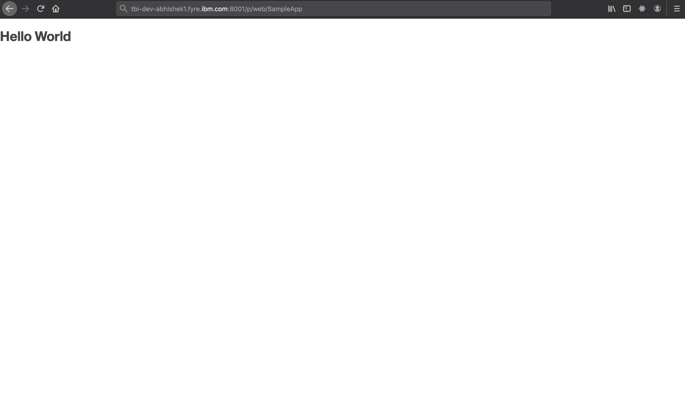

At this stage your SampleApp directory should look like [this](./src/1_hellow_world_template/SampleApp)

## Creating the application javascript

1. Create a new javascript file called app.js in `ibm-sampleapp/app.js` and copy the content below to the same file.

    ```
    Polymer({

        is: "ibm-sampleapp",

        behaviors: [TriPlatViewBehavior]

    });
    ```
2. Update the `ibm-sampleapp/ibm-sampleapp.html` with the reference of above created file as shown below. 

    ```
    <link rel="import" href="../triplat-view-behavior/triplat-view-behavior.html">

    <link rel="import" href="../paper-material/paper-material.html">

    <dom-module id="ibm-sampleapp">
        <template>
            <H1>Hello World</H1>
        </template>
    </dom-module>
    <script src="app.js"></script>
    ```
3. Push the files using
    ```
    tri-deploy -t <tririga_url> -u <user> -p <password> -v ibm-sampleapp -d ibm-sampleapp -y 1
    ```

You should find the "Hello World" still working.

At this stage your SampleApp directory should look like [this](./src/2_application_in_Javascript/SampleApp)

## Creating a standalone React Application

We will use webpack to create standalone React Application 

1. Open a new terminal and cd to `SampleApp` directory

2. Create a directory for standalone React Application `mkdir ReactApp && cd ReactApp/`

3. Initialize application using npm `npm init -y `

4. Install dependencies `npm i react react-dom -S`

5. Install dev dependencies
    ```
    npm i @babel/core @babel/plugin-proposal-class-properties @babel/polyfill @babel/preset-env @babel/preset-react babel-loader css-loader style-loader webpack webpack-cli uglifyjs-webpack-plugin -D
    ```

6. Create `webpack.config.js` file with following configurations

    ```
    const UglifyJsPlugin = require("uglifyjs-webpack-plugin")
    module.exports = {
        module: {
            rules: [
                {
                    test: /\.js$/,
                    exclude: /node_modules/,
                    use: {
                        loader: "babel-loader"
                    }
                },
                {
                    test: /\.css$/,

                    use: [{
                        loader: "style-loader" // creates style nodes from JS strings
                    },
                    {
                        loader: "css-loader", options: { url: false }// translates CSS into CommonJS
                    }]
                }
            ]
        },
        plugins: [new UglifyJsPlugin()]
    }
    ```
7. Create `.babelrc` file with following content
    ```
    {
        "presets": [
            "@babel/preset-env",
            "@babel/preset-react"
        ],
        "plugins": ["@babel/plugin-proposal-class-properties"]
    }
    ```
8. Create src directory `mkdir src && cd src`

9. Create `index.js` file with following content in src directory
    ```
    import React from "react";
    import ReactDOM from "react-dom";
    import './style.css'
    const Hello = () => {
    return <div className="app">Hello World from React!</div>;
    };
    ReactDOM.render(<Hello />, document.getElementById("root"))
    ```
10. Create `style.css` file with following content in src directory
    ```
    .app{
        font-size: 8rem;
        color: #ff0000;
    }
    ```
11. Update the build statement in `package.json` file, under scripts add the following
    ```
    "build": "webpack --mode production"
    ```
12. Now build the React Application by running `npm run build`

13. Once the build is successful you will see a `dist` directory. Create `index.html` file with following content to verify the react application is running properly
    ```
    <div id="root"></div>
    <script src="main.js"></script>
    ```
14. Open the index.html file in any browser you should be able to see following

    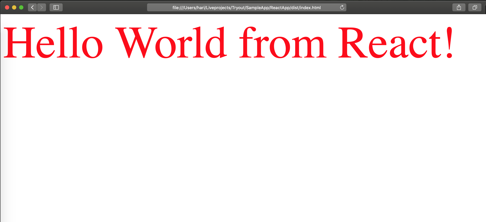

At this stage your SampleApp directory should look like [this](./src/3_standalone_react_application/SampleApp)

## Rendering React Application in TRIRIGA Perceptive Application

**Important:** Each time you run `npm run build`, make sure to Push your changes to TRIRIGA server using following command.
```
 tri-deploy -t <tririga_url> -u <user> -p <password> -v ibm-sampleapp -d ibm-sampleapp -y 1` 
 ```
 


#### Modifying Perceptive Application

1. Replace the `ibm-sapmpleapp/ibm-sapmpleapp.html` file with the following content
    ```
     <link rel="import" href="../polymer/polymer.html"> 
    <dom-module id="ibm-sampleapp">
        <template>
            <poly-react-wrapper id="SampleApp">
            </poly-react-wrapper>
        </template>
    </dom-module>
    <script>
        window.Polymer({
            is: "ibm-sampleapp",
            attached: function(){
                let loading = document.getElementById("app-loading-indicator");
                if (loading) document.body.removeChild(loading);
            }
        });
    </script>
    <script src="main.js"></script>

    ```

2. Delete `ibm-sapmpleapp/app.js` file 


#### Modifying React Application

Update the `SampleApp/ReactApp/index.js` file to render the React Application in the Polymer web-component `<poly-react-wrapper>` which will wrap our React Application.
```
    import React from "react";
    import ReactDOM from "react-dom";
    import './style.css'

    const Hello = () => {
        return <div className="app">Hello World from React!</div>;
    };
    window.Polymer({
        is: "poly-react-wrapper",
        attached: function () {
            ReactDOM.render(<Hello />, document.getElementById("SampleApp"))
        }
    })

```

### Wrapping Polymer and React Framework

1. Go to directory `SampleApp/ReactApp`. Run `npm run build` 

2. Copy the build file to Perceptive Application by 

    ```
    cp dist/main.js ../ibm-sampleapp/main.js
    ``` 

    and push your changes by running following command 
    ```
    tri-deploy -t <tririga_url> -u <user> -p <password> -v ibm-sampleapp -d ibm-sampleapp -y 1
    ```

3. Open `http(s)://<TRIRIGA_HOST>:<PORT>/<CONTEXT_ROOT>/p/web/SampleApp` URL and you should see following 

    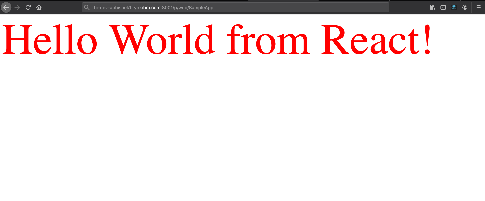

4. Update the build statement in `package.json` file, under scripts with the following 
    ```
    "build": "webpack --mode production && cp dist/main.js ../ibm-sampleapp/main.js"
    ```

At this stage your SampleApp directory should look like [this](./src/4_rendering_react_app_in_TRIRIGA/SampleApp)


## Rendering Carbon Design System components / PAL in TRIRIGA Perceptive Application

### Updating standalone React Application

1. Open a new terminal and cd to `SampleApp/ReactApp` directory
2. Install additional dependencies
    ```
    npm i carbon-addons-iot-react d3@">=5.0.0 <=5.14.2" -S
    ```
3. Install scss related dev dependencies 
    ```
     npm i postcss-loader sass-loader@7.1.0 node-sass autoprefixer -D
    ```
4. Create new `postcss.config.js` file with the following content 
    ```
    module.exports = {
        plugins: [
            require('autoprefixer')
        ]
    };
    ```
5. Update `webpack.config.js` file with following content
    ```
    const path = require('path');
    const { dirname, join } = path;
    const UglifyJsPlugin = require("uglifyjs-webpack-plugin")
    module.exports = {
        module: {
            rules: [
                {
                    test: /\.js$/,
                    exclude: /node_modules/,
                    use: {
                        loader: "babel-loader"
                    }
                },
                {
                    test: /\.scss$/,

                    use: [{
                        loader: "style-loader" // creates style nodes from JS strings
                    },
                    {
                        loader: "css-loader", options: { url: false }// translates CSS into CommonJS
                    },
                    {
                        loader: 'postcss-loader',
                        options: {
                            sourceMap: true,
                            config: {
                                path: 'postcss.config.js'
                            }
                        }
                    },
                    {
                        loader: "sass-loader",// compiles Sass to CSS
                        options: {
                            includePaths: [join(dirname('carbon-addons-iot-react'), 'node_modules')]
                        }
                    }]
                }
            ]
        },
        plugins: [new UglifyJsPlugin()]
    }
    ```
6. Rename the `style.css` file to `style.scss` file.
7. Update the `index.js` import statement from `import './style.css'` to `import './style.scss'`.
8. Now run `npm run build` it should run successfully.
9. Push your changes to TRIRIGA server using following command.
    ```
    tri-deploy -t <tririga_url> -u <user> -p <password> -v ibm-sampleapp -d ibm-sampleapp -y 1
    ```

### Rendering Carbon shell 

**Important:** Each time you run `npm run build`, make sure to Push your changes to TRIRIGA server using following command.
```
 tri-deploy -t <tririga_url> -u <user> -p <password> -v ibm-sampleapp -d ibm-sampleapp -y 1` 
 ```
1. Go to directory `SampleApp/ReactApp`. 
2. Update `index.js` with following 

    ```
    import React from "react";
    import ReactDOM from "react-dom";
    import './style.scss'

    import {
        Header,
    } from "carbon-addons-iot-react";

    const conf = {
        appName: "Sample Application",
        actionItems: []
    };

    const App = () => {
        return <>
            <Header
            {...conf}
            />
            <div className="app">Placeholder for you app content</div>
        </>;
    };

    window.Polymer({
        is: "poly-react-wrapper",
        attached: function () {
            ReactDOM.render(<App />, document.getElementById("SampleApp"))
        }
    })
    
    ```

3. Update `style.scss` with the fallowing 

    ```
    @import "~carbon-addons-iot-react/scss/styles.scss";
    .app{
        padding-top: 4rem;
        @include type-style("productive-heading-03");
    }
    ```

4. Now run `npm run build` then Push your changes to TRIRIGA server using following command.
    ```
    tri-deploy -t <tririga_url> -u <user> -p <password> -v ibm-sampleapp -d ibm-sampleapp -y 1
    ```
5. Now you should see the Carbon UI shell in the perceptive app at `http(s)://<TRIRIGA_HOST>:<PORT>/<CONTEXT_ROOT>/p/web/SampleApp`

    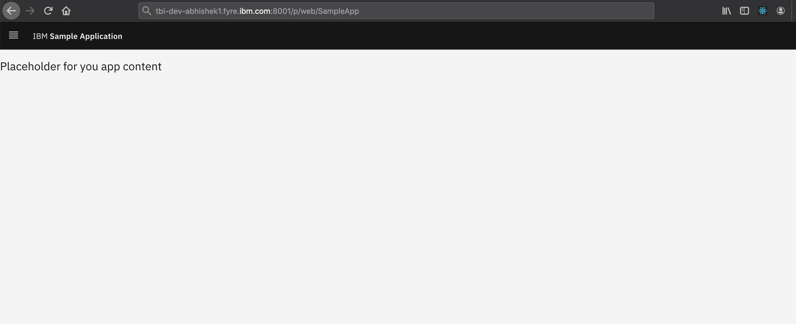


For more information on `webpack.config.js` for Carbon please refer [here](https://github.com/carbon-design-system/carbon/blob/master/packages/react/.storybook/webpack.config.js)

At this stage your SampleApp directory should look like [this](./src/5_rendering_PAL_in_TRIRIGA_perceptive_app/SampleApp)

### Creating dashboard 

At this point you have successfully created a TRIRIGA Perceptive Application rendering React Application. Further we have rendered Carbon UI shell in the dashboard. 

In this step, we will render few more components from Watson IoT Patterns and Assets Library.

**Important:** Each time you run `npm run build`, make sure to Push your changes to TRIRIGA server using following command.
```
 tri-deploy -t <tririga_url> -u <user> -p <password> -v ibm-sampleapp -d ibm-sampleapp -y 1` 
 ```
 

1. Create a new directory called `app` in path `SampleApp/ReactApp/src` and go to `SampleApp/ReactApp/src/app`

2. Create a file `components.js` in the app directory with the following content
    ```
    import React from "react";
    import {
        StatefulTable,
        StatefulTileCatalog,
        CatalogContent
    } from "carbon-addons-iot-react";
    import Add from '@carbon/icons-react/lib/add/32';

    //Sample table component
    export function Table(props) {
        return (
            <StatefulTable
                columns={[
                    {
                        filter: {
                            placeholderText: 'pick a string'
                        },
                        id: 'string',
                        name: 'String'
                    },
                    {
                        filter: {
                            placeholderText: 'pick a date'
                        },
                        id: 'date',
                        name: 'Date'
                    },
                    {
                        filter: {
                            options: [
                                {
                                    id: 'option-A',
                                    text: 'option-A'
                                },
                                {
                                    id: 'option-B',
                                    text: 'option-B'
                                },
                                {
                                    id: 'option-C',
                                    text: 'option-C'
                                }
                            ],
                            placeholderText: 'pick an option'
                        },
                        id: 'select',
                        name: 'Select'
                    },
                    {
                        id: 'secretField',
                        name: 'Secret Information'
                    },
                    {
                        id: 'status',
                        name: 'Status',
                    },
                    {
                        filter: {
                            placeholderText: 'pick a number'
                        },
                        id: 'number',
                        name: 'Number'
                    }
                ]}
                data={[
                    {
                        id: 'row-1',
                        rowActions: undefined,
                        values: {
                            date: '1973-03-14T23:33:20.000Z',
                            number: 1,
                            secretField: 'OewGc0QsMs',
                            select: 'option-B',
                            status: 'NOT_RUNNING',
                            string: 'helping whiteboard as 1'
                        }
                    },
                    {
                        id: 'row-4',
                        rowActions: undefined,
                        values: {
                            date: '1973-09-04T14:13:20.000Z',
                            number: 16,
                            secretField: '46GYyWC0w0',
                            select: 'option-B',
                            status: 'NOT_RUNNING',
                            string: 'can pinocchio whiteboard 4'
                        }
                    },
                    {
                        id: 'row-16',
                        rowActions: undefined,
                        values: {
                            date: '1981-04-13T08:53:20.000Z',
                            number: 256,
                            secretField: 'muYiOaIWGW',
                            select: 'option-B',
                            status: 'NOT_RUNNING',
                            string: 'eat whiteboard pinocchio 16'
                        }
                    },
                    {
                        id: 'row-22',
                        rowActions: undefined,
                        values: {
                            date: '1988-07-04T06:13:20.000Z',
                            number: 484,
                            secretField: '8oCI6cqmQm',
                            select: 'option-B',
                            status: 'NOT_RUNNING',
                            string: 'whiteboard can eat 22'
                        }
                    },
                    {
                        id: 'row-31',
                        rowActions: undefined,
                        values: {
                            date: '2003-08-16T02:13:20.000Z',
                            number: 961,
                            secretField: 'AAAAAAAAAA',
                            select: 'option-B',
                            status: 'NOT_RUNNING',
                            string: 'helping whiteboard as 31'
                        }
                    },
                    {
                        id: 'row-34',
                        rowActions: undefined,
                        values: {
                            date: '2009-10-20T00:53:20.000Z',
                            number: 1156,
                            secretField: 'qcUSWgwIkI',
                            select: 'option-B',
                            status: 'NOT_RUNNING',
                            string: 'can pinocchio whiteboard 34'
                        }
                    },
                    {
                        id: 'row-46',
                        rowActions: undefined,
                        values: {
                            date: '2040-03-22T03:33:20.000Z',
                            number: 2116,
                            secretField: 'YQmcwk2o4o',
                            select: 'option-B',
                            status: 'NOT_RUNNING',
                            string: 'eat whiteboard pinocchio 46'
                        }
                    },
                    {
                        id: 'row-52',
                        rowActions: undefined,
                        values: {
                            date: '2058-11-08T16:53:20.000Z',
                            number: 2704,
                            secretField: 'uKQCema4E4',
                            select: 'option-B',
                            status: 'NOT_RUNNING',
                            string: 'whiteboard can eat 52'
                        }
                    },
                    {
                        id: 'row-61',
                        rowActions: undefined,
                        values: {
                            date: '2091-01-30T12:53:20.000Z',
                            number: 3721,
                            secretField: 'wgO4iKuSyS',
                            select: 'option-B',
                            status: 'NOT_RUNNING',
                            string: 'helping whiteboard as 61'
                        }
                    },
                    {
                        id: 'row-64',
                        rowActions: undefined,
                        values: {
                            date: '2102-12-19T19:33:20.000Z',
                            number: 4096,
                            secretField: 'c8iM4qgaYa',
                            select: 'option-B',
                            status: 'NOT_RUNNING',
                            string: 'can pinocchio whiteboard 64'
                        }
                    },
                    {
                        id: 'row-76',
                        rowActions: undefined,
                        values: {
                            date: '2156-03-15T06:13:20.000Z',
                            number: 5776,
                            secretField: 'Kw0WUum6s6',
                            select: 'option-B',
                            status: 'NOT_RUNNING',
                            string: 'eat whiteboard pinocchio 76'
                        }
                    },
                    {
                        id: 'row-82',
                        rowActions: undefined,
                        values: {
                            date: '2186-03-30T11:33:20.000Z',
                            number: 6724,
                            secretField: 'gqe6CwKM2M',
                            select: 'option-B',
                            status: 'NOT_RUNNING',
                            string: 'whiteboard can eat 82'
                        }
                    },
                    {
                        id: 'row-91',
                        rowActions: undefined,
                        values: {
                            date: '2235-08-02T07:33:20.000Z',
                            number: 8281,
                            secretField: 'iCcyGUekmk',
                            select: 'option-B',
                            status: 'NOT_RUNNING',
                            string: 'helping whiteboard as 91'
                        }
                    },
                    {
                        id: 'row-94',
                        rowActions: undefined,
                        values: {
                            date: '2253-03-03T22:13:20.000Z',
                            number: 8836,
                            secretField: 'OewGc0QsMs',
                            select: 'option-B',
                            status: 'NOT_RUNNING',
                            string: 'can pinocchio whiteboard 94'
                        }
                    }
                ]}
                secondaryTitle="Sample Table"
                id="Table"
                lightweight={false}
                options={{
                    hasFilter: true,
                    hasPagination: true,
                    hasRowSelection: 'multi'
                }}
                useZebraStyles={false}
                view={{
                    pagination: {
                        pageSize: 10,
                        pageSizes: [10, 15],
                        page: 1,
                        totalItems: 14
                    },
                    table: {
                        ordering: [
                            {
                                columnId: 'string',
                                isHidden: false
                            },
                            {
                                columnId: 'date',
                                isHidden: false
                            },
                            {
                                columnId: 'select',
                                isHidden: false
                            },
                            {
                                columnId: 'secretField',
                                isHidden: true
                            },
                            {
                                columnId: 'status',
                                isHidden: false
                            },
                            {
                                columnId: 'number',
                                isHidden: false
                            }
                        ]
                    },
                    toolbar: {
                        activeBar: 'filter'
                    }
                }}
            />
        );
    }

    //Sample tile component
    const longDescription =
        'Really long string with lots of lots of text too much to show on one line and when it wraps it might cause some interesting issues especially if it starts vertically wrapping outside of tile bounds at the bottom of the tile';

    const tileRenderFunction = ({ values }) => <CatalogContent {...values} icon={<Add />} />;

    const commonTileCatalogProps = {
        title: 'My Tile Catalog',
        id: 'entityType',
        tiles: [
            {
                id: 'test1',
                values: {
                    title: 'Test Tile with really long title that should wrap',
                    description: longDescription,
                },
                renderContent: tileRenderFunction,
            },
            {
                id: 'test2',
                values: { title: 'Test Tile2', description: longDescription },
                renderContent: tileRenderFunction,
            },
            {
                id: 'test3',
                values: { title: 'Test Tile3', description: 'Tile contents' },
                renderContent: tileRenderFunction,
            },
            {
                id: 'test4',
                values: { title: 'Test Tile4', description: longDescription },
                renderContent: tileRenderFunction,
            },
            {
                id: 'test5',
                values: { title: 'Test Tile5', description: longDescription },
                renderContent: tileRenderFunction,
            },
            {
                id: 'test6',
                values: { title: 'Test Tile6', description: longDescription },
                renderContent: tileRenderFunction,
            },
            {
                id: 'test7',
                values: { title: 'Test Tile7', description: longDescription },
                renderContent: tileRenderFunction,
            },
        ],
    };

    export function Tiles(props) {
        return (
            <StatefulTileCatalog
                {...commonTileCatalogProps}
                search={{
                    placeHolderText: 'Search catalog',
                }}
                pagination={{ pageSize: 6 }}
            />

        );
    }

    ```
    Here we are creating two react components Table and Tiles using the standard components from Watson IoT Patterns and Assets Library.
3. Create a `index.js` in the app directory with fallowing content. 
    ```
    import React from "react";
    import {
        HeaderContainer,
        Header,
        SideNav,
        PageTitleBar,
        Tabs,
        Tab,
    } from "carbon-addons-iot-react";
    import Home from "@carbon/icons-react/lib/home/24";
    import Dashboard from "@carbon/icons-react/lib/dashboard/24";

    import { Table, Tiles } from "./components";

    const conf = {
        appName: "Sample Application",
        actionItems: []
    };
    const links = [
        {
            icon: Home,
            isEnabled: true,
            metaData: {
                label: "Devices",
                href: "#",
                element: "a"
            },
            linkContent: "Home"
        },
        {
            isEnabled: true,
            icon: Dashboard,
            metaData: {
                label: "Devices",
                href: "#",
                element: "a"
            },
            linkContent: "Dashboard"
        }
    ];
    export function App() {
        return <>
            <HeaderContainer
                render={({ isSideNavExpanded, onClickSideNavExpand }) => (
                    <React.Fragment>
                        <Header
                            {...conf}
                            isSideNavExpanded={isSideNavExpanded}
                            onClickSideNavExpand={onClickSideNavExpand}
                        />
                        <SideNav
                            links={links}
                            isSideNavExpanded={isSideNavExpanded}
                            onClickSideNavExpand={onClickSideNavExpand}
                        />
                    </React.Fragment>
                )}
            />
            <div
                style={{ paddingTop: "3rem", paddingLeft: "3rem" }}
            >
                <PageTitleBar
                    breadcrumb={[
                        <a href="/">Home</a>,
                        <a href="/">Type</a>,
                        <span>Instance</span>
                    ]}
                    isLoading={false}
                    title={"Page Title"}
                    collapsed={false}
                    editable={false}
                />

                <div style={{ paddingLeft: "2rem" }}>
                    <Tabs
                        ariaLabel="listbox"
                        iconDescription="show menu options"
                        role="navigation"
                        selected={0}
                        tabContentClassName="tab-content"
                        triggerHref="#"
                    >
                        <Tab
                            href="#"
                            label="Tab label 1"
                            role="presentation"
                            selected={false}
                            tabIndex={0}
                        >
                            <Table />

                        </Tab>
                        <Tab
                            href="#"
                            label="Tab label 2"
                            role="presentation"
                            selected={false}
                            tabIndex={0}
                        >
                            <Tiles />
                        </Tab>
                    </Tabs>

                </div>
            </div>
        </>;
    };

    ```
    Here we are rendering the following components
    * UI Shell
    * Page Title with Breadcrumb
    * Tabs
    * Table 
    * Tiles

4. Update the `SampleApp/ReactApp/src/index.js` file with the following
    ```
    import React from "react";
    import ReactDOM from "react-dom";
    import './style.scss'
    import {App} from "./app";

    window.Polymer({
    is: "poly-react-wrapper",
    attached: function () {
        ReactDOM.render(<App />, document.getElementById("SampleApp"))
    }
    })

    ```

5. Now open terminal and navigate to path `SampleApp/ReactApp`
6. Build the application by running `npm run build`
7. Push your changes to TRIRIGA server using following command
    ```
    tri-deploy -t <tririga_url> -u <user> -p <password> -v ibm-sampleapp -d ibm-sampleapp -y 1
    ```
8. Now you should see the starter dashboard here -  `http(s)://<TRIRIGA_HOST>:<PORT>/<CONTEXT_ROOT>/p/web/SampleApp`
    
    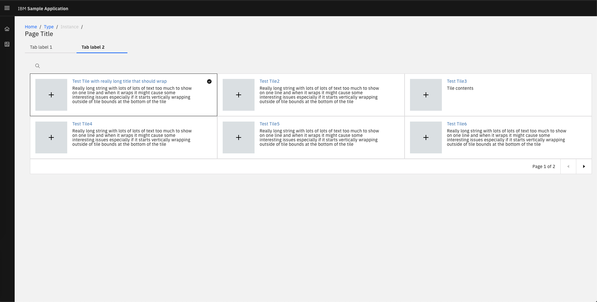

At this stage your SampleApp directory should look like [this](./src/6_creating_dashboard_in_TRIRIGA_perceptive_app/SampleApp)


## License

This code pattern is licensed under the Apache License, Version 2. Separate third-party code objects invoked within this code pattern are licensed by their respective providers pursuant to their own separate licenses. Contributions are subject to the [Developer Certificate of Origin, Version 1.1](https://developercertificate.org/) and the [Apache License, Version 2](https://www.apache.org/licenses/LICENSE-2.0.txt).

[Apache License FAQ](https://www.apache.org/foundation/license-faq.html#WhatDoesItMEAN)
